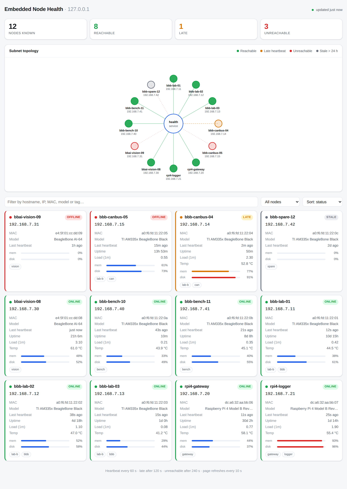

# Embedded Node Health

A small service that answers one question for students working with embedded
Linux boards on the research subnet: **is my device up, and at what address?**

Each node runs a tiny shell agent that sends a heartbeat every 60 seconds. The
server records it and the dashboard at
`http://daily-server.research.colostate.edu/embedded_health/` shows every known
node as a green, amber or red dot with its IP address, plus a card with the
hardware model, MAC, uptime, load, memory, disk and CPU temperature.



## Why heartbeats instead of scanning

The obvious design is to have the server ping or `nmap` the subnet. That is the
wrong tool here. A sweep of a /24 every minute is thousands of packets that
touch every device whether or not anyone cares about it, it needs the server to
know the address space in advance, it cannot tell a powered-off board from one
that simply has no address yet, and on a lab subnet full of student equipment it
looks exactly like hostile reconnaissance.

Pushed heartbeats invert all of that. The node is the authority on its own
state, it reports the address it actually holds (so DHCP churn is visible rather
than confusing), and the traffic is bounded and predictable: roughly 300 bytes
out and 60 bytes back per node per interval. A hundred nodes at the default
60-second cadence cost under 1 kB/s — about 0.001% of a 100 Mbit link. Agents
stagger their first beat by a per-device jitter so that a rack of boards powered
on together does not synchronise into a burst, and a failed beat backs off
exponentially to a 10-minute ceiling, so a server outage produces a trickle
rather than a retry storm.

The cadence is owned by the server, not the fleet. Every heartbeat reply carries
the interval the server wants, and agents adopt it. Re-timing a hundred boards
is one line in `/etc/embedded-health/server.env` and a service restart.

## What the colours mean

A node is **green** once a heartbeat has arrived within the last two intervals,
**amber** between two and four, and **red** past four — four minutes of silence
at the default cadence. That grace period is deliberate: it absorbs a DHCP
renewal, a switch reconvergence or one dropped packet without crying wolf, while
still surfacing a genuinely dead board within a few minutes. A node that has
said nothing for a day is shown **grey**, because it has almost certainly been
decommissioned rather than merely gone down.

When the address a node reports differs from the address its packets arrive
from, the card shows both. That is usually a NAT or a second interface, and it
is exactly the sort of thing that is invisible until something breaks.

## Layout

```
server/    Flask app, SQLite state, and the self-contained dashboard
agent/     the node-side heartbeat agent, its systemd unit and installer
deploy/    production deployment script, systemd unit, nginx site
```

## Deploying the server

On `daily-server`, from a clone of this repository:

```sh
sudo ./deploy/deploy.sh --repo https://github.com/<you>/embedded_health.git
```

or, on a machine with nothing checked out yet:

```sh
curl -fsSL https://raw.githubusercontent.com/<you>/embedded_health/main/deploy/deploy.sh \
  | sudo bash -s -- --repo https://github.com/<you>/embedded_health.git
```

The script installs any missing prerequisites, clones or fast-forwards the
repository into `/opt/embedded-health`, builds a virtualenv, creates the
unprivileged `embedded-health` system user, installs and enables the systemd
unit, renders the nginx site, reloads nginx, and then proves the whole path
works by fetching the dashboard and posting a throwaway heartbeat through nginx
before deleting it again. It is idempotent — run it again to upgrade; it keeps
the database and any edits you have made to `server.env`.

Useful flags: `--branch`, `--iface` (default `eth0`), `--listen ADDR` to override
interface detection, `--server-name`, `--interval`, `--no-nginx`, and
`--uninstall` (which removes the services and the nginx site but keeps the
database).

### How it is bound

Gunicorn listens on `127.0.0.1:8787` and nothing else. nginx is the only thing
that talks to it, and nginx is pinned to the IPv4 address of `eth0` rather than
`0.0.0.0`, so the service is reachable from the research subnet and from nowhere
else — a stray route or a second interface coming up later cannot expose it.
The deploy script resolves that address at install time and fails loudly if
`eth0` has none yet.

`Restart=always` plus `systemctl enable` covers both halves of "always up": the
service comes back after a crash and after a reboot. The unit runs under a
dedicated user with `ProtectSystem=strict`, a read-only code tree, a syscall
filter and a 256 MB memory cap, and gunicorn's systemd watchdog restarts it if
a worker wedges.

## Installing the agent on a node

On each BeagleBone Black (or Pi, or anything else running Linux):

```sh
git clone https://github.com/<you>/embedded_health.git
cd embedded_health
sudo ./agent/install-agent.sh \
  --url http://daily-server.research.colostate.edu/embedded_health/api/heartbeat \
  --tags lab-b,bench-3
```

The installer copies the agent to `/usr/local/sbin`, writes
`/etc/embedded-health/agent.conf`, **sends one test heartbeat so a typo in the
URL fails here rather than silently six months from now**, then installs and
starts the systemd unit — or a BusyBox-compatible init script on images without
systemd. The node appears on the dashboard within one interval.

The agent is POSIX `/bin/sh` with no dependency beyond `curl` (or `wget`) and
`/proc`, so it runs on stripped-down images where Python is not installed and
would be a silly thing to install. It identifies itself by the MAC of its uplink
interface, falling back to `/etc/machine-id`, so a node keeps its identity across
reflashes and DHCP address changes. It runs as `nobody` under a hardened unit
with a 32 MB cap, niced and set to idle I/O, so it can never be the reason a
board misbehaves.

Check on it with `journalctl -u node-health-agent -f`, or send a single beat by
hand with `sudo /usr/local/sbin/node-health-agent.sh --once`.

## API

Everything is unauthenticated, which is intentional — the page is meant to be
glanced at, and the whole surface is confined to the lab subnet by the nginx
bind.

`POST api/heartbeat` takes the agent's JSON and replies with the interval the
agent should use. `GET api/nodes` returns the full fleet state with derived
status. `GET api/summary` returns counts only, which is the cheap endpoint to
point an external monitor at. `POST api/nodes/<device_id>/forget` drops a
decommissioned board. `GET api/healthz` is the service's own self-check.

Untrusted input is treated as such throughout: the body is capped at 4 kB,
`device_id` must match `[A-Za-z0-9:._-]{4,64}`, every string is stripped to
printable ASCII and truncated, every number is range-clamped, the node table is
capped, a node beating faster than a sixth of its interval is throttled at the
application layer, and nginx rate-limits by source address on top of that. The
dashboard escapes everything it renders.

State lives in SQLite in WAL mode under `/var/lib/embedded-health`, so the last
known state of every node survives a service restart or a server reboot.
Liveness is derived at read time from `last_seen` rather than by a sweeper
thread, which means there is no background task to wedge and nothing to lose
when a worker recycles.

## Configuration

Server settings live in `/etc/embedded-health/server.env`
(`EH_HEARTBEAT_INTERVAL`, `EH_LATE_AFTER_BEATS`, `EH_OFFLINE_AFTER_BEATS`,
`EH_STALE_AFTER_HOURS`, `EH_MAX_NODES`); restart the service after editing.
Agent settings live in `/etc/embedded-health/agent.conf` on each node
(`HEALTH_URL`, `INTERVAL`, `IFACE`, `TAGS`, `MODEL`).

## Running it locally

```sh
pip install -r server/requirements.txt
EH_DB_PATH=/tmp/nodes.db python3 server/app.py    # http://127.0.0.1:8787/
```
